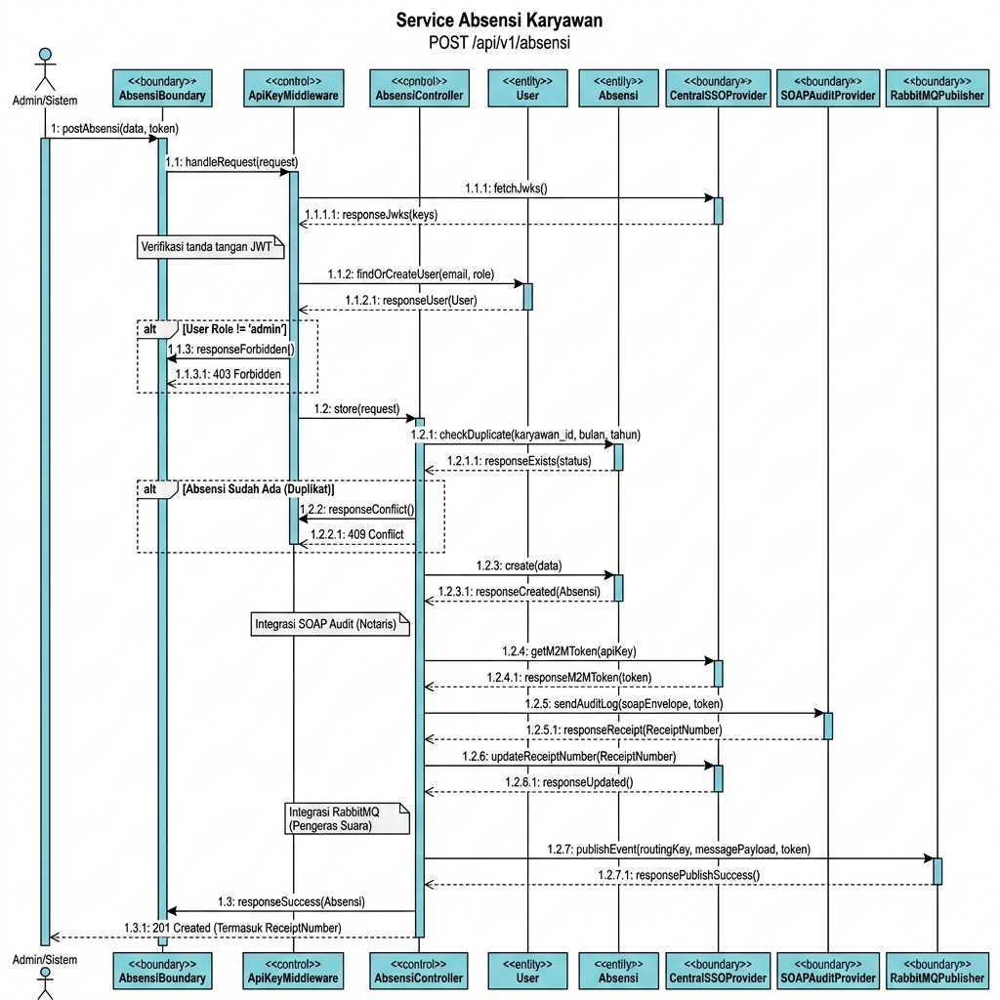

# Dokumen Analisis Tugas 3 - Service Absensi Karyawan

> **Nama:** Ramdani Cahyo Bagaskara  
> **NIM:** 102022400319  
> **Service:** Absensi (Service 2)  
> **Ekosistem:** Human Resource - Penggajian Karyawan  

## 1. Analisis Transaksi Kritis & Alur Integrasi (Analogi Sederhana)

Didalam sistem absensi ini, ada satu kegiatan penting yang tidak boleh dilakukan secara sembarangan, yaitu **pembuatan rekap absensi bulanan** (`POST /api/v1/absensi`). Jika data absensi ini salah, maka perhitungan gaji karyawan akan kacau. Oleh karena itu, kegiatan ini disebut sebagai **transaksi kritis**.

Untuk menjaga keamanan dan keakuratan transaksi ini, sistem absensi dihubungkan dengan tiga layanan pusat menggunakan analogi kehidupan sehari-hari sebagai berikut:

### 1. Federated SSO (Single Sign-On) — Analogi: "Kartu Akses Masuk Gedung Kantor"
Bayangkan Anda berada di sebuah gedung perkantoran besar terpadu. 
* Daripada setiap ruangan meminta Anda mengisi formulir pendaftaran dan membuat password baru (yang sangat merepotkan), Anda cukup mendaftarkan diri sekali saja di lobby utama (Server SSO).
* Lobby utama akan memberikan Anda sebuah **Kartu Akses Resmi (JWT Token)**.
* Saat Anda ingin masuk ke ruangan Absensi, Anda cukup menempelkan kartu tersebut. Sistem pembaca kartu di pintu akan memeriksa tanda tangan digital kartu tersebut ke pusat (JWKS) untuk memastikan kartu itu asli.
* Kartu ini juga menyimpan hak akses Anda (**Role-Based Access Control / RBAC**). Jika Anda adalah **Tamu biasa (Role: warga)**, Anda hanya boleh melihat data dari balik kaca (Read-only / GET). Namun, jika Anda adalah **Manajer (Role: admin)**, Anda baru diperbolehkan masuk ke dalam ruangan untuk membuat laporan absensi baru (Write / POST).

### 2. SOAP XML Audit Client — Analogi: "Buku Catatan Transaksi Resmi Notaris (Lembar Bersegel)"
Karena data absensi menentukan uang gaji karyawan, setiap laporan baru yang dibuat harus dicatat di buku jurnal resmi milik notaris pusat agar tidak ada pihak yang bisa berbohong di kemudian hari (*non-repudiation*).
* Setiap kali manajer selesai membuat laporan absensi baru, laporan tersebut dibungkus dalam sebuah **Amplop Khusus yang Kaku dan Tersegel Lilin (SOAP XML Envelope)**. Data di dalamnya juga dibungkus pelindung tambahan agar tidak rusak selama perjalanan (**CDATA**).
* Amplop tersebut dikirimkan ke Kantor Notaris Pusat (SOAP Audit Service).
* Notaris akan membaca laporan tersebut, menyetujuinya, dan memberikan stempel dengan **Nomor Tanda Terima Resmi (ReceiptNumber)**.
* Nomor tanda terima resmi ini kemudian kita tuliskan dan simpan kembali di dokumen absensi lokal kita sebagai bukti sah bahwa transaksi telah diaudit secara resmi.

### 3. AMQP Event Publisher (RabbitMQ) — Analogi: "Pengeras Suara Gedung / Toa Pengumuman"
Setelah laporan absensi resmi ditandatangani dan dicap oleh notaris, bagian keuangan (Service Penggajian/Payroll) perlu segera mengetahuinya agar bisa mulai menghitung gaji karyawan.
* Daripada manajer harus lelah berjalan kaki mendatangi ruangan bagian keuangan satu per satu, manajer cukup menggunakan **Mikrofon Pengeras Suara Kantor (Message Publisher)**.
* Manajer menyiarkan pengumuman di saluran khusus: *"Perhatian! Rekap absensi baru bulan Juni telah selesai dibuat!"* (routing key: `absensi.created` dengan isi pesan format JSON).
* Sistem pengeras suara pusat (**RabbitMQ Message Broker**) akan menangkap siaran tersebut dan menyebarkannya langsung ke ruangan bagian keuangan yang sedang mendengarkan saluran tersebut. 
* Bahkan jika bagian keuangan sedang sibuk atau tutup sementara, pesan siaran tersebut akan tetap ditampung di kotak surat mereka (**Queue**) hingga mereka siap membacanya.

---

## 2. Sequence Diagram Internal (Format Visual Paradigm)

Berikut adalah alur interaksi internal di dalam Service Absensi saat memproses pembuatan absensi baru. Struktur dan penamaan komponen menggunakan gaya diagram **Visual Paradigm** (menggunakan controller `<<boundary>>`, `<<control>>`, dan `<<entity>>`):

